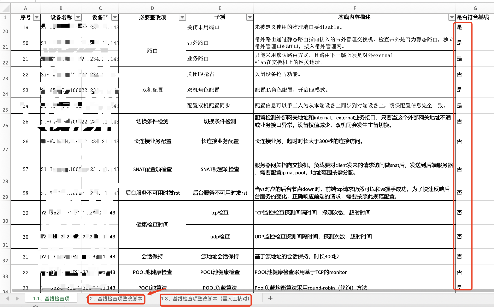

= What's it?
:toc: manual

A series of tools that used to run BIG-IP in a automated way.

* link:f5bigip/configParse.py[f5bigip/configParse.py] provide a lib to parse `tmsh show running-config` and generate F5 BIG-IP VS/Pool/Snat/Monitor/Profile.
* link:f5-tmsh-generator.py[f5-tmsh-generator.py] will generate tmsh scripts base on application form link:config/app.input[config/app.input] and exist running config
* link:f5-tmsh-validation.py[f5-tmsh-validation.py] use to varify the BIG-IP's configuration base on the specific defined in excel(link:config/test.xlsx[sample.xlsx]), and result also write to excel
* link:f5-tmsh-system-checking.py[f5-tmsh-system-checking.py] is a BIG-IP System Checking tool that collect a series critical running metric.

== Usage

=== Run Generator

[source, bash]
----
% ./f5-tmsh-generator.py config/f5config.3 config/app.input
--- 一号机网络配置 ---
tmsh create net vlan External_vlan701 interfaces add { Link_trunk { tagged } } tag 701
tmsh create net vlan Internal_vlan1069 interfaces add { Link_trunk { tagged } } tag 1069
tmsh create net self External_selfip_vlan701 address 10.1.10.240/24 vlan External_vlan701 allow-service none
tmsh create net self External_floatingip_vlan701 address 10.1.10.242/24 vlan External_vlan701 allow-service none traffic-group /Common/traffic-group-1
tmsh create net self Internal_selfip_vlan1069 address 10.1.20.240/24 vlan Internal_vlan1069 allow-service none
tmsh create net self Internal_floatingip_vlan1069 address 10.1.20.242/24 vlan Internal_vlan1069 allow-service none traffic-group /Common/traffic-group-1
--- 二号机网络配置 ---
tmsh create net vlan External_vlan701 interfaces add { Link_trunk { tagged } } tag 701
tmsh create net vlan Internal_vlan1069 interfaces add { Link_trunk { tagged } } tag 1069
tmsh create net self External_selfip_vlan701 address 10.1.10.241/24 vlan External_vlan701 allow-service none
tmsh create net self External_floatingip_vlan701 address 10.1.10.242/24 vlan External_vlan701 allow-service none traffic-group /Common/traffic-group-1
tmsh create net self Internal_selfip_vlan1069 address 10.1.20.241/24 vlan Internal_vlan1069 allow-service none
tmsh create net self Internal_floatingip_vlan1069 address 10.1.20.242/24 vlan Internal_vlan1069 allow-service none traffic-group /Common/traffic-group-1
---  业务变更配置  ---
tmsh create ltm pool YiTiHuaYunWeiPingTai_10.1.10.15_80_pool members add {  10.1.20.3:8080 10.1.20.4:8080 10.1.20.5:8080 10.1.20.7:8080 10.1.20.28:8080 10.1.20.29:8080 10.1.20.30:8080 } monitor tcp
tmsh create ltm snatpool YiTiHuaYunWeiPingTai_10.1.10.15_80_snat members add {  10.1.10.108 10.1.10.109 }
tmsh create ltm virtual YiTiHuaYunWeiPingTai_10.1.10.15_80_vs destination 10.1.10.15:80 pool YiTiHuaYunWeiPingTai_10.1.10.15_80_pool ip-protocol tcp profiles add { fastL4 { } } source-address-translation { type snat pool YiTiHuaYunWeiPingTai_10.1.10.15_80_snat }
tmsh save sys config
---  变更回退配置  ---
tmsh delete ltm virtual YiTiHuaYunWeiPingTai_10.1.10.15_80_vs
tmsh delete ltm snatpool YiTiHuaYunWeiPingTai_10.1.10.15_80_snat
tmsh delete ltm pool YiTiHuaYunWeiPingTai_10.1.10.15_80_pool
tmsh delete net self Internal_floatingip_vlan1069
tmsh delete net self Internal_selfip_vlan1069
tmsh delete net self External_floatingip_vlan701
tmsh delete net self External_selfip_vlan701
tmsh delete net vlan Internal_vlan1069
tmsh delete net vlan External_vlan701
tmsh save sys config
----

=== Run Validation

[source, bash]
----
% ./f5-tmsh-validation.py config/bigip-v13.running-config config/test.xlsx
----

=== Run System Checking

[source, bash]
----
% ./f5-tmsh-system-checking.py 
{'key': '设备型号', 'value': 'BIG-IP xxxx'}
{'key': '设备序列号', 'value': 'f5-xxxx-xxxx'}
{'key': '检查运行时间是否超过52周', 'value': '系统运行时间小于 1 天'}
{'key': '软件版本', 'value': '15.1.9.1'}
{'key': '当前时间与服务器时间差值', 'value': '340 小时'}
{'key': '设备 linense 到期时间', 'value': '2023/09/25'}
{'key': 'CPU 使用率', 'value': '9%'}
{'key': '数据平面内存利用', 'value': '4%'}
{'key': '管理平面内存利用', 'value': '74%'}
{'key': 'CPU 1 温度', 'value': '32'}
{'key': '风扇 1 状态', 'value': 'status: up, Fan Speed(rpm): 11806'}
{'key': '风扇 2 状态', 'value': 'status: up, Fan Speed(rpm): 12000'}
{'key': '风扇 3 状态', 'value': 'status: up, Fan Speed(rpm): 11619'}
{'key': '风扇 4 状态', 'value': 'status: up, Fan Speed(rpm): 12000'}
{'key': '电源 1 状态', 'value': 'up'}
{'key': '电源 2 状态', 'value': 'up'}
{'key': '/var 存储空间使用率', 'value': '14%'}
{'key': '/config 存储空间使用率', 'value': '1%'}
{'key': '/appdata 存储空间使用率', 'value': '1%'}
{'key': '/shared 存储空间使用率', 'value': '1%'}
{'key': '/var/log 存储空间使用率', 'value': '2%'}
{'key': '接口 1.1 状态', 'value': 'up'}
{'key': '接口 1.2 状态', 'value': 'up'}
{'key': '接口 1.3 状态', 'value': 'up'}
{'key': '接口 1.4 状态', 'value': 'up'}
{'key': '接口 1.5 状态', 'value': 'up'}
{'key': '接口 1.6 状态', 'value': 'up'}
{'key': '接口 1.7 状态', 'value': 'up'}
{'key': '接口 1.8 状态', 'value': 'up'}
{'key': '接口 2.1 状态', 'value': 'up'}
{'key': '接口 2.2 状态', 'value': 'up'}
{'key': '接口 mgmt 状态', 'value': 'down'}
{'key': '检查双机状态', 'value': 'standby'}
{'key': '当前并发会话数', 'value': '0'}
{'key': '客户端新建会话数', 'value': '0'}
{'key': '服务端新建会话数', 'value': '0'}
{'key': '吞吐量 In', 'value': 'current: 0, avg: 160, max: 7.4K'}
{'key': '吞吐量 Out', 'value': 'current: 0, avg: 7, max: 2.0K'}
{'key': '检查是否配置心跳检测', 'value': '是'}
{'key': '检查主备是否同步', 'value': 'In Sync'}
{'key': 'vs_1 运行状态', 'value': 'available'}
{'key': 'vs_2 运行状态', 'value': 'unknown'}
{'key': 'vs_3 运行状态', 'value': 'available'}
{'key': 'vs_4 运行状态', 'value': 'available'}
{'key': 'vs_5 运行状态', 'value': 'offline'}
{'key': 'vs_6 运行状态', 'value': 'offline'}
{'key': '接口 1.1 收发包情况', 'value': 'Bits In: 3.3T, Bits Out: 134.0G, Pkts In: 1.8G, Pkts Out: 221.2M'}
{'key': '接口 1.2 收发包情况', 'value': 'Bits In: 1.8T, Bits Out: 441.3G, Pkts In: 1.1G, Pkts Out: 380.5M'}
{'key': '接口 1.3 收发包情况', 'value': 'Bits In: 1.8T, Bits Out: 92.3G, Pkts In: 1.1G, Pkts Out: 150.7M'}
{'key': '接口 1.4 收发包情况', 'value': 'Bits In: 2.0T, Bits Out: 109.7G, Pkts In: 1.1G, Pkts Out: 178.7M'}
{'key': '接口 1.5 收发包情况', 'value': 'Bits In: 2.9G, Bits Out: 5.9G, Pkts In: 3.8M, Pkts Out: 3.5M'}
{'key': '接口 1.6 收发包情况', 'value': 'Bits In: 1.3G, Bits Out: 4.6G, Pkts In: 812.8K, Pkts Out: 2.8M'}
{'key': '接口 1.7 收发包情况', 'value': 'Bits In: 1.4G, Bits Out: 5.8G, Pkts In: 617.8K, Pkts Out: 5.5M'}
{'key': '接口 1.8 收发包情况', 'value': 'Bits In: 1.1G, Bits Out: 6.5G, Pkts In: 544.0K, Pkts Out: 4.1M'}
{'key': '接口 2.1 收发包情况', 'value': 'Bits In: 274.3G, Bits Out: 14.7K, Pkts In: 147.2M, Pkts Out: 23'}
{'key': '接口 2.2 收发包情况', 'value': 'Bits In: 2.4K, Bits Out: 26.8M, Pkts In: 3, Pkts Out: 51.8K'}
{'key': '接口 mgmt 收发包情况', 'value': 'Bits In: 11.9M, Bits Out: 30.1M, Pkts In: 8.7K, Pkts Out: 6.1K'}
----
